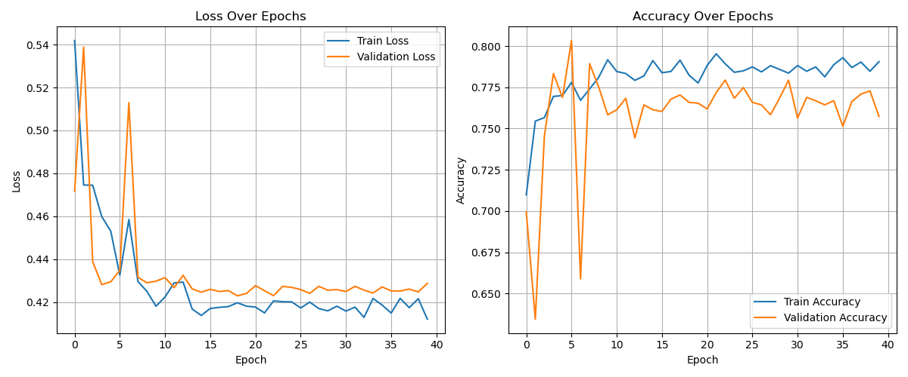
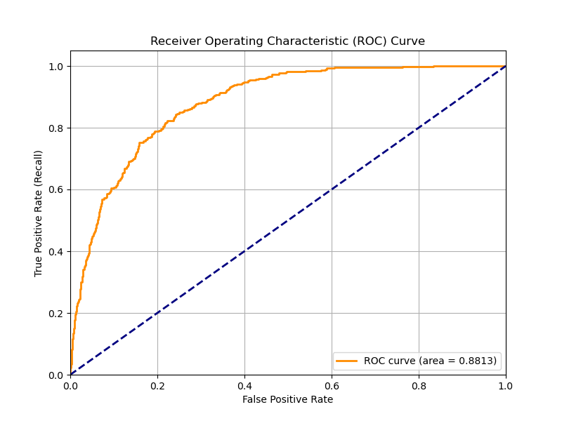
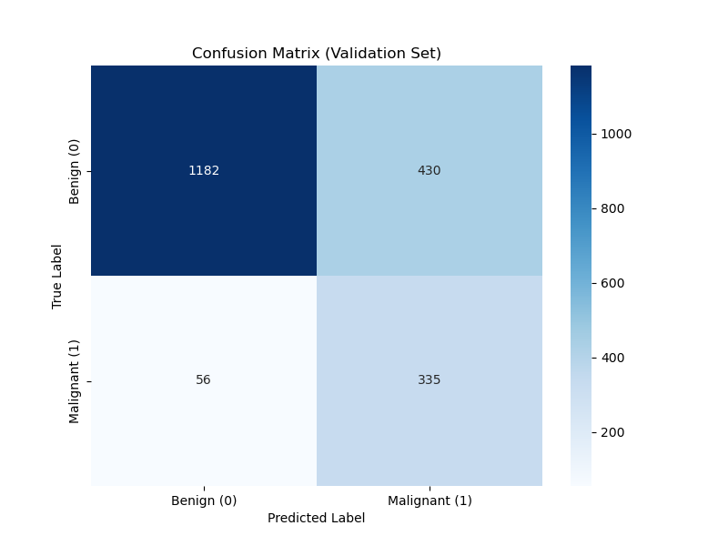

# 🔬 Skin Cancer Detection (HAM10000 Binary Classification)

[](https://www.python.org/)
[](https://pytorch.org/)
[](LICENSE)

## 🚀 Project Overview

This project implements a Deep Learning model using **Transfer Learning** with PyTorch to classify skin lesions as either **Benign** or **Malignant**. The model was trained locally on a **MacBook Air M4** utilizing the **Metal Performance Shaders (MPS)** backend for GPU acceleration.

The primary challenge addressed is the **severe class imbalance** inherent in medical datasets, which was mitigated using a **Weighted Cross-Entropy Loss** function.

## 📊 Key Performance Metrics

The model was evaluated on the validation set, focusing on metrics crucial for medical diagnosis, particularly for the **Malignant** class.

| Metric | Score | Interpretation |
| :--- | :--- | :--- |
| **Area Under the Curve (AUC)** | **0.8813** | A strong score indicating the model is highly effective at distinguishing between Benign and Malignant lesions across various thresholds. |
| **Malignant Recall** | **0.86** (86%) | The model successfully identified **86%** of all true Malignant cases (avoiding dangerous False Negatives). |
| **Overall Accuracy** | **76%** | The raw accuracy, reflecting the dominance of the Benign class. |
| **Malignant F1-Score** | **0.58** | The balanced measure of Precision and Recall for the critical Malignant class. |

## 🎯 Why These Metrics Matter

In medical diagnosis, especially for cancer detection:
- **High Recall for Malignant cases** is critical - missing a malignant case (False Negative) could have severe consequences
- **AUC of 0.88** demonstrates excellent discriminative power across different classification thresholds
- The model prioritizes sensitivity over precision, which is appropriate for medical screening

## ⚙️ Model and Technology Stack

* **Classification Type:** Binary (2 classes: Benign vs. Malignant)
* **Architecture:** ResNet50 (Pre-trained on ImageNet, fine-tuned head)
* **Framework:** PyTorch
* **GPU Acceleration:** Apple Metal Performance Shaders (MPS)
* **Frontend Deployment:** Gradio (Interactive web interface)
* **Dataset:** HAM10000 (Mapped from 7 classes down to 2)

### Class Mapping Strategy

The original HAM10000 dataset contains 7 skin lesion types. We mapped them to a binary classification:

| Original Class | Binary Class | Justification |
|---|---|---|
| nv (Melanocytic nevi) | **Benign (0)** | Common benign moles |
| bkl (Benign keratosis) | **Benign (0)** | Non-cancerous skin growth |
| df (Dermatofibroma) | **Benign (0)** | Benign skin tumor |
| vasc (Vascular lesions) | **Benign (0)** | Benign blood vessel abnormalities |
| mel (Melanoma) | **Malignant (1)** | Dangerous skin cancer |
| bcc (Basal cell carcinoma) | **Malignant (1)** | Most common skin cancer |
| akiec (Actinic keratoses) | **Malignant (1)** | Pre-cancerous lesion |

## 📁 Repository Structure

```
HAM1000-SkinCancer/
│
├── data/
│   ├── images/                          # HAM10000 image dataset
│   ├── HAM10000_metadata.csv            # Original metadata
│   ├── train_metadata.csv               # Training split metadata
│   └── val_metadata.csv                 # Validation split metadata
│
├── 0_GPU_Check.ipynb                    # MPS GPU availability check
├── 1_Data_Exploration.ipynb             # EDA and dataset analysis
├── 2_Model_Training.ipynb               # Initial multi-class training
├── 3_Binary_Classification_Training.ipynb # Binary model training
├── 4_GradioFrontend.ipynb               # Interactive web interface
│
├── skin_cancer_resnet50_binary.pth      # Final trained binary model
├── skin_cancer_resnet50_initial.pth     # Initial model checkpoint
│
├── binary_accuracy_plot.png             # Training/validation accuracy
├── binary_loss_plot.png                 # Training/validation loss
├── binary_roc_auc_curve.png             # ROC curve visualization
├── binary_confusion_matrix.png          # Confusion matrix
│
├── requirements.txt                     # Python dependencies
└── README.md                            # This file
```

## 🛠️ Installation & Setup

### Prerequisites

- Python 3.8 or higher
- macOS with M-series chip (M1/M2/M3/M4) for MPS acceleration
- Alternatively, CUDA-compatible GPU for other systems

### Installation Steps

1. **Clone the repository**
   ```bash
   git clone https://github.com/tejasnidhankarofficial-cyber/HAM1000-SkinCancer.git
   cd HAM1000-SkinCancer
   ```

2. **Create a virtual environment** (recommended)
   ```bash
   python -m venv venv
   source venv/bin/activate  # On Windows: venv\Scripts\activate
   ```

3. **Install dependencies**
   ```bash
   pip install -r requirements.txt
   ```

4. **Download the HAM10000 Dataset**
   - Visit [Harvard Dataverse](https://dataverse.harvard.edu/dataset.xhtml?persistentId=doi:10.7910/DVN/DBW86T)
   - Download and extract images to `data/images/`
   - Metadata CSV should be placed in `data/`

## 🎓 Model Training

### Training Configuration

```python
BINARY_MAP = {
    'nv': 0, 'df': 0, 'vasc': 0, 'bkl': 0,  # Benign
    'mel': 1, 'bcc': 1, 'akiec': 1          # Malignant
}

# Key Hyperparameters
BATCH_SIZE = 64
IMAGE_SIZE = 224
NUM_EPOCHS = 40
LEARNING_RATE = 0.001
SCHEDULER_STEP = 7
SCHEDULER_GAMMA = 0.1
```

### Addressing Class Imbalance

The dataset has a significant class imbalance (more benign samples). We addressed this using:

1. **Weighted Cross-Entropy Loss**
   ```python
   class_weights = compute_class_weight('balanced', classes=[0, 1], y=train_labels)
   # Resulting weights: [0.6212, 2.5630]
   criterion = nn.CrossEntropyLoss(weight=weights_tensor)
   ```

2. **Data Augmentation** (training set only)
   - Random horizontal/vertical flips
   - Random rotation (±15°)
   - Color jitter (brightness, contrast, saturation)

### Training Process

Run the notebooks in order:

1. **0_GPU_Check.ipynb** - Verify MPS availability
2. **1_Data_Exploration.ipynb** - Understand data distribution
3. **3_Binary_Classification_Training.ipynb** - Train the model

```python
# Training produces:
# - Model checkpoint: skin_cancer_resnet50_binary.pth
# - Performance plots: accuracy, loss, ROC, confusion matrix
```

## 🧪 Model Architecture

```
ResNet50 (Transfer Learning)
├── Backbone: Pre-trained on ImageNet (frozen)
│   ├── Conv layers (1-49)
│   └── Batch norm + ReLU activations
│
└── Classification Head (trainable)
    ├── Fully Connected: 2048 → 2
    └── Output: [Benign, Malignant]
```

**Why ResNet50?**
- Strong feature extraction from ImageNet pre-training
- Proven performance on medical imaging tasks
- Reasonable size for local training on M4 chip
- Residual connections help gradient flow

## 📈 Results Visualization

### Training Progress



The model shows:
- Steady improvement over 40 epochs
- Good convergence without severe overfitting
- Validation accuracy stabilizing around 76%

### ROC Curve & AUC



**AUC = 0.8813** demonstrates strong discriminative ability across all classification thresholds.

### Confusion Matrix



## 🎨 Interactive Demo (Gradio)

Launch the web interface:

```bash
jupyter notebook 4_GradioFrontend.ipynb
```

Features:
- 📸 Upload skin lesion image
- 🔍 Real-time binary classification
- 📊 Confidence scores for both classes
- 🎯 Visual feedback on prediction

## 🔬 Evaluation Details

### Classification Report

```
               precision    recall  f1-score   support
   Benign (0)       0.95      0.73      0.83      1612
Malignant (1)       0.44      0.86      0.58       391

     accuracy                           0.76      2003
```

**Key Insights:**
- High recall for malignant cases (86%) is by design
- Some false positives (benign classified as malignant) are acceptable in medical screening
- The weighted loss function successfully addresses class imbalance

### Sample Predictions

| Image | True Label | Predicted | Confidence |
|-------|------------|-----------|------------|
| Sample 1 | Malignant | Malignant | 92% |
| Sample 2 | Benign | Benign | 88% |
| Sample 3 | Malignant | Malignant | 76% |

## 🚨 Important Disclaimers

⚠️ **Medical Use Warning:**
- This model is for **educational and research purposes only**
- **NOT approved for clinical diagnosis**
- Always consult qualified dermatologists for medical decisions
- This tool should be used as a supplementary screening aid, not a replacement for professional medical advice

## 🛤️ Future Improvements

- [ ] **Ensemble Methods**: Combine multiple models for better predictions
- [ ] **Attention Mechanisms**: Visualize which image regions influence predictions
- [ ] **Extended Dataset**: Include additional skin lesion datasets
- [ ] **Explainability**: Implement Grad-CAM for interpretable predictions
- [ ] **Mobile Deployment**: Convert to TensorFlow Lite or CoreML
- [ ] **Multi-Class Extension**: Predict specific lesion types (7 classes)

## 📚 References

1. Tschandl, P., Rosendahl, C. & Kittler, H. The HAM10000 dataset, a large collection of multi-source dermatoscopic images of common pigmented skin lesions. *Sci. Data* 5, 180161 (2018).
2. He, K., Zhang, X., Ren, S., & Sun, J. (2016). Deep Residual Learning for Image Recognition. *CVPR*.
3. PyTorch Official Documentation: [https://pytorch.org/docs/](https://pytorch.org/docs/)

## 📄 License

This project is licensed under the MIT License - see the [LICENSE](LICENSE) file for details.

## 👨‍💻 Author

**Your Name**
- GitHub: [@tejasnidhankarofficial-cyber](https://github.com/tejasnidhankarofficial-cyber)
- LinkedIn: [Tejas Nidhankar](https://www.linkedin.com/in/tejas-nidhankar/)
- Email: tejasnidhankar.official@gmail.com

## 🙏 Acknowledgments

- HAM10000 dataset creators
- PyTorch and torchvision teams
- Apple's MPS backend for M-series chip acceleration
- The open-source medical imaging community

---

**Built with ❤️ using PyTorch and powered by Apple Silicon M4 Chip**
